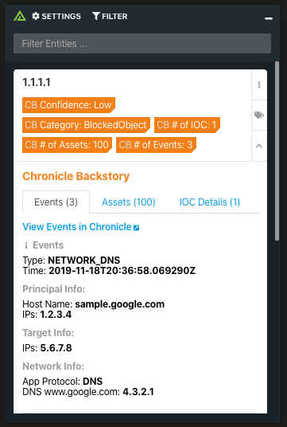
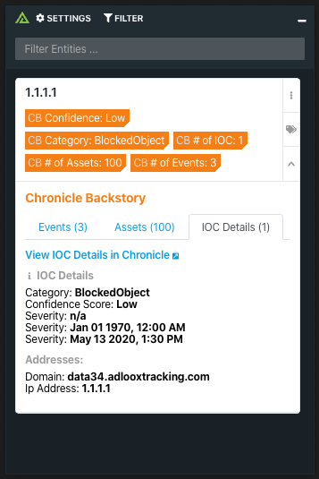

# Polarity Chronicle Backstory Integration


Chronicle Backstory combines intelligence about global threats in the wild, threats inside your network, and unique signals about both.

Polarity's Chronicle Backstory integration allows automated queries to the Events, Assets, and IOC Details endpoints in Chronicle Backstory's API from the Polarity overlay window.

<div style="display:flex; justify-content:center; align-items:center;">
  
  
</div>
<div style="display:flex; justify-content:center; align-items:center;">
  
</div>


To learn more about Chronicle Backstory, visit the [official website]([https://chronicle.security](https://chronicle.security/products/platform/)).


## Chronicle Backstory Integration Options

### Chronicle Domain
The domain you use for accessing Chronicle Backstory.  This does not include the full URL or "http(s)://" but can include your regional subdomain.

### Issuer Email
The Issuer Email associated with your Google Service Account

### Private Key
The Private Key associated with your Google Service Account

### Ignore Asset Results
Allows you to ignore results that only contain Asset data, while containing no Event or IOC data. 
> NOTE: This will not remove Assets from the results that do contain Event or IOC data

### Sources to Search
Select one or more data sources to search.


### Days Back
The number of days you would like to look back for Events and Assets. Supports fractional days (e.g., 0.25 would be 8 hours)


## Known Issues

### 503 Server Errors

The Chronicle REST API will time out with a 503 HTTP Status Code when searching assets for certain IP addresses.  If this is happening you may see an error like this:

```
{
  error: {
    "status": 503,
    "description": "UNAVAILABLE -> The service is currently unavailable."
  }
}
```

You can try adjusting the "Days Back" option to reduce the amount of data that Chronicle searches or turn off "Asset" search.


## Creating a Service Account
To get access to a Issuer Email and Private Key you must first create a Google Service Account. For more information about this process go to Google's [OAuth 2.0 docs here](https://developers.google.com/identity/protocols/oauth2/service-account).

A service account's credentials include a generated email address that is unique and at least one public/private key pair. If domain-wide delegation is enabled, then a client ID is also part of the service account's credentials.

If your application runs on Google App Engine, a service account is set up automatically when you create your project.

If your application runs on Google Compute Engine, a service account is also set up automatically when you create your project, but you must specify the scopes that your application needs access to when you create a Google Compute Engine instance. For more information, see [Preparing an instance to use service accounts](https://cloud.google.com/compute/docs/access/create-enable-service-accounts-for-instances#using).

If your application doesn't run on Google App Engine or Google Compute Engine, you must obtain these credentials in the Google API Console. To generate service-account credentials, or to view the public credentials that you've already generated, do the following:

1. Open the [Service accounts page](https://console.developers.google.com/iam-admin/serviceaccounts).
2. If prompted, select a project, or create a new one.
3. Click **Create service account**.
4. In the **Create service account** window, type a name for the service account, and select **Furnish a new private key**. If you want to [grant G Suite domain-wide authority](https://developers.google.com/identity/protocols/OAuth2ServiceAccount#delegatingauthority) to the service account, also select **Enable G Suite Domain-wide Delegation**.
5. Click **Create**.

Your new public/private keypair is generated and downloaded to your machine; it serves as the only copy of this key. You are responsible for storing it securely. If you lose this keypair, you will need to generate a new one.

You can return to the [API Console](https://console.developers.google.com/) at any time to view the email address, public key fingerprints, and other information, or to generate additional public/private key pairs. For more details about service account credentials in the API Console, see [Service accounts](https://cloud.google.com/iam/docs/understanding-service-accounts) in the API Console help file.

Take note of the service account's email address and store the service account's P12 private key file in a location accessible to your application. Your application needs them to make authorized API calls.

> Note: You must store and manage private keys securely in both development and production environments. Google does not keep a copy of your private keys, only your public keys.

### Delegating domain-wide authority to the service account
If you have a G Suite domain—if you use G Suite, for example—an administrator of the G Suite domain can authorize an application to access user data on behalf of users in the G Suite domain. For example, an application that uses the Google Calendar API to add events to the calendars of all users in a G Suite domain would use a service account to access the Google Calendar API on behalf of users. Authorizing a service account to access data on behalf of users in a domain is sometimes referred to as "delegating domain-wide authority" to a service account.

> Note: When you use G Suite Marketplace to install an application for your domain, the required permissions are automatically granted to the application during installation. You do not need to manually authorize the service accounts that the application uses. The account must have domain-wide delegation before the application is installed.

> Note: Although you can use service accounts in applications that run from a G Suite domain, service accounts are not members of your G Suite account and aren't subject to domain policies set by G Suite administrators. For example, a policy set in the G Suite admin console to restrict the ability of G Suite end users to share documents outside of the domain would not apply to service accounts.

To delegate domain-wide authority to a service account, first enable domain-wide delegation for an existing service account in the [**Service accounts** page](https://console.developers.google.com/iam-admin/serviceaccounts) or [create a new service account](https://developers.google.com/identity/protocols/oauth2/service-account#creatinganaccount) with domain-wide delegation enabled.

Then, an administrator of the G Suite domain must complete the following steps:

1. Go to your G Suite domain's [Admin console](https://admin.google.com/).
   
2. Select **Security** from the list of controls. If you don't see **Security** listed, select **More controls** from the gray bar at the bottom of the page, then select **Security** from the list of controls. If you can't see the controls, make sure you're signed in as an administrator for the domain.
3. Select **Show more** and then **Advanced settings** from the list of options.
4. Select **Manage API client access** in the **Authentication** section.
5. In the **Client Name** field enter the service account's **Client ID**. You can find your service account's client ID in the [**Service accounts** page](https://console.developers.google.com/iam-admin/serviceaccounts).
6. In the **One or More API Scopes** field enter the list of scopes that your application should be granted access to. For Chronicle Backstory the scope is `https://www.googleapis.com/auth/chronicle-backstory.
7. Click **Authorize**.

Your application now has the authority to make API calls as users in your domain (to "impersonate" users). When you prepare to make authorized API calls, you specify the user to impersonate.


## Installation Instructions

Installation instructions for integrations are provided on the [PolarityIO GitHub Page](https://polarityio.github.io/).


## Polarity

Polarity is a memory-augmentation platform that improves and accelerates analyst decision making.  For more information about the Polarity platform please see:

https://polarity.io/
