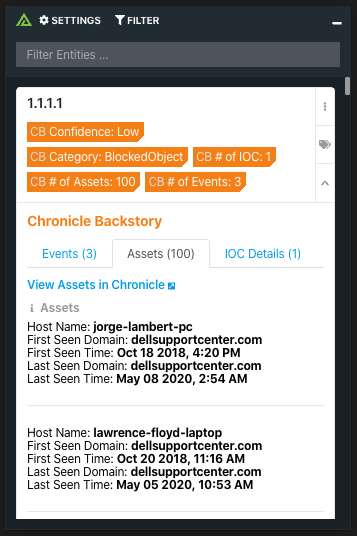

# Polarity Chronicle Backstory Integration

Chronicle Backstory combines intelligence about global threats in the wild, threats inside your network, and unique signals about both.

Polarity's Chronicle Backstory integration allows automated queries to the Events, Assets, and IOC Details endpoints in Chronicle Backstory's API from the Polarity overlay window.

  
  

  

To learn more about Chronicle Backstory, visit the [official website]([https://chronicle.security](https://chronicle.security/products/platform/)).

## Chronicle Backstory Integration Options

### Issuer Email

The Issuer Email associated with your Google Service Account

### Private Key

The Private Key associated with your Google Service Account

### Ignore Asset Results

Allows you to ignore results that only contain Asset data, while containing no Event or IOC data.
> NOTE: This will not remove Assets from the results that do contain Event or IOC data'

### Months Back

The number of months you would like to look back for Events and Assets (decimals work as well, e.g. 0.25)

## Installation Instructions

Installation instructions for integrations are provided on the [PolarityIO GitHub Page](https://polarityio.github.io/).

## Polarity

Polarity is a memory-augmentation platform that improves and accelerates analyst decision making.  For more information about the Polarity platform please see:

https://polarity.io/
